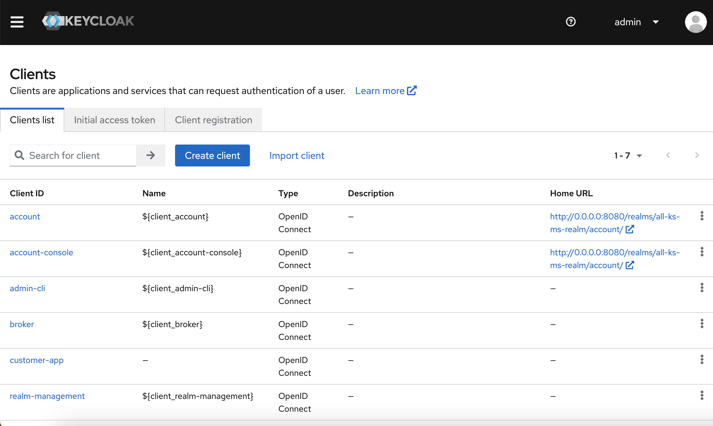
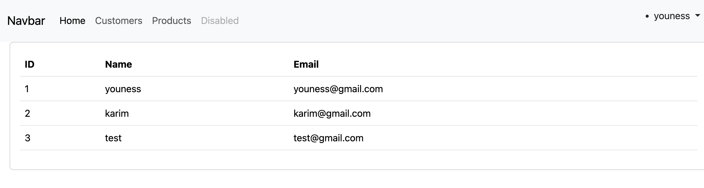
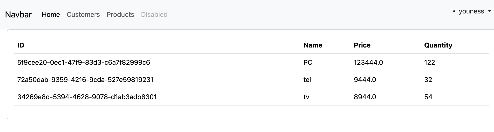

* ### Build using Angular, Spring Security, Spring Boot, KeyCloak, JWT, OAuth2, OpenId Connect, Thymeleaf

## ScreenShots :
## KeyCloak DashBoard: 

## Roles:

## Customers:

## Products:

## API&SERVICE:

